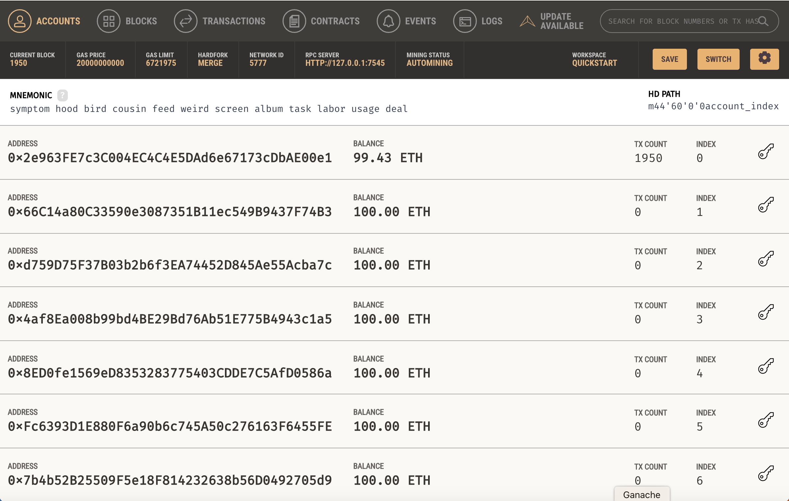

# Trabajo Práctico 8

## Consigna

Implementar una API REST que interactúe con los contratos `CFP` y `CFPFactory` del práctico anterior y permita acceder a sus funcionalidades.

En la API los *hashes*, direcciones y transacciones se expresarán como cadenas hexadecimales de la longitud adecuada y el prefijo "0x". Los valores enteros se expresarán como números decimales. La información temporal (por ejemplo, fecha y hora del cierre de convocatoria), deberá expresarse en formato ISO 8601.

El contrato `CFPFactory` debe estar desplegado en Ganache, la api debe conectarse con Ganache mediante http, y debe responder a requerimientos escuchando en el puerto 5000 de `localhost`.

La API deberá trabajar con una cuenta local, es decir, debe poder interactuar con un nodo que no tiene definida ninguna cuenta. Sin embargo, esta cuenta se obtendrá de la frase mnemónica que corresponda a la instancia Ganache en la que esté desplegado el contrato, y debe coincidir con la cuenta que desplegó el contrato.

El servidor debe recibir por línea de comandos o por un archivo de configuración la información necesaria para ser ejecutado. En ningún caso debe ser necesario modificar el código para que el servidor se ejecute.

La ABI y dirección de los contratos pueden obtenerse de los archivos creados por Truffle en el directorio `build` del proyecto.

La API debe proveer los siguientes *endpoints*:

### `/create`

* Crea un llamado a presentación de propuestas utilizando la función correspondiente de `CFPFactory`.
* Método: `POST`
* Content-type: `application/json`
* Cuerpo: Un objeto JSON con los siguientes campos:
  * `callId`: Hash que identifica al llamado.
  * `closingTime`: Fecha y hora del cierre de convocatoria, expresada en formato ISO 8601.
  * `signature`: Firma de la dirección del contrato concatendada con `callId` con la clave privada del que hace la llamada. La API utiliza la dirección que se deriva de la firma para asignarle la propiedad de la propuesta creada. El mensaje a firmar es una secuencia de bytes de longitud 52. Los primeros 20 bytes son la dirección del contrato, y los siguientes 32 bytes son el `callId`. El mensaje es procesado por `encode_defunct` de `eth_account.messages` de la biblioteca `eth-account` de Python antes de ser firmado.
* Retorno exitoso:
  * Código HTTP: 201
  * Cuerpo: Un objeto JSON con un campo "message" con valor OK.
* Retorno fallido:
  * Código HTTP: Según la tabla siguiente.
  * Cuerpo: Un objeto JSON con un campo "message" con valor indicado en la tabla siguiente.

    | Causa                    | Código |  Mensaje             |
    |--------------------------|--------|----------------------|
    |Content-Type incorrecto   | 400    | INVALID_MIMETYPE     |
    |callId mal formado        | 400    | INVALID_CALLID       |
    |closingTime mal formado   | 400    | INVALID_TIME_FORMAT  |
    |callId ya existente       | 403    | ALREADY_CREATED      |
    |emisor no autorizado      | 403    | UNAUTHORIZED         |
    |tiempo de cierre inválido | 400    | INVALID_CLOSING_TIME |
    |firma inválida            | 400    | INVALID_SIGNATURE    |
    |desconocida               | 500    | INTERNAL_ERROR       |

### `/register`

* Permite a un usuario registrarse para crear llamados, y los autoriza de inmediato.
* Método: `POST`
* Content-type: `application/json`
* Cuerpo: Un objeto JSON con los siguientes campos:
  * `address`: Dirección del solicitante
  * `signature`: Firma de la dirección del contrato con la clave privada del solicitante. El mensaje a firmar es una secuencia de bytes de longitud 20. El mensaje es procesado por `encode_defunct` de `eth_account.messages` de la biblioteca `eth-account` de Python antes de ser firmado.
* Retorno exitoso:
  * Código HTTP: 200
  * Cuerpo: Un objeto JSON con un campo "message" con valor OK.
* Retorno fallido:
  * Código HTTP: Según la tabla siguiente.
  * Cuerpo: Un objeto JSON con un campo "message" con valor indicado en la tabla siguiente.

    | Causa                    | Código |  Mensaje             |
    |--------------------------|--------|----------------------|
    |Content-Type incorrecto   | 400    | INVALID_MIMETYPE     |
    |dirección inválida        | 400    | INVALID_ADDRESS      |
    |ya estaba autorizado      | 403    | ALREADY_AUTHORIZED   |
    |firma inválida            | 400    | INVALID_SIGNATURE    |
    |desconocida               | 500    | INTERNAL_ERROR       |

### `/register-proposal`

* Permite a un usuario registrar una propuesta en un determinado llamado.
* Método: `POST`
* Content-type: `application/json`
* Cuerpo: Un objeto JSON con los siguientes campos:
  * `callId`: Hash que identifica al llamado.
  * `proposal`: Hash que identifica a la propuesta.
* Retorno exitoso:
  * Código HTTP: 201
  * Cuerpo: Un objeto JSON con un campo "message" con valor OK.
* Retorno fallido:
  * Código HTTP: Según la tabla siguiente.
  * Cuerpo: Un objeto JSON con un campo "message" con valor indicado en la tabla siguiente.

    | Causa                    | Código |  Mensaje             |
    |--------------------------|--------|----------------------|
    |Content-Type incorrecto   | 400    | INVALID_MIMETYPE     |
    |callId mal formado        | 400    | INVALID_CALLID       |
    |callId inexistente        | 404    | CALLID_NOT_FOUND     |
    |propuesta mal formada     | 400    | INVALID_PROPOSAL     |
    |propuesta ya existente    | 403    | ALREADY_REGISTERED   |
    |desconocida               | 500    | INTERNAL_ERROR       |

### `/authorized/:address`

* Método: `GET`
* Argumento: `:address` corresponde a una dirección
* Retorno exitoso:
  * Código HTTP: 200
  * Cuerpo: Un objeto JSON con un campo booleano
    * "authorized", el estado de autorización de la dirección provista.
* Retorno fallido:
  * Código HTTP: Según la tabla siguiente.
  * Cuerpo: Un objeto JSON con un campo "message" con valor indicado en la tabla siguiente.

    | Causa                    | Código |  Mensaje             |
    |--------------------------|--------|----------------------|
    |dirección inválida        | 400    | INVALID_ADDRESS      |
    |desconocida               | 500    | INTERNAL_ERROR       |

### `/calls/:call_id`

* Método: `GET`
* Argumento: `:call_id` es el hash que identifica a un llamado
* Retorno exitoso:
  * Código HTTP: 200
  * Cuerpo: Un objeto JSON con dos campos de tipo `string`:
    * "creator", la dirección del creador del llamado.
    * "cfp", la dirección del contrato que representa al llamado.
* Retorno fallido:
  * Código HTTP: Según la tabla siguiente.
  * Cuerpo: Un objeto JSON con un campo "message" con valor indicado en la tabla siguiente.

    | Causa                    | Código |  Mensaje             |
    |--------------------------|--------|----------------------|
    |callId mal formado        | 400    | INVALID_CALLID       |
    |callId inexistente        | 404    | CALLID_NOT_FOUND     |
    |desconocida               | 500    | INTERNAL_ERROR       |

### `/closing-time/:call_id`

* Método: `GET`
* Argumento: `:call_id` es el hash que identifica a un llamado
* Retorno exitoso:
  * Código HTTP: 200
  * Cuerpo: Un objeto JSON con un campo de tipo `string`:
    * "closingTime", la fecha y hora de cierre del llamado, en formato ISO 8601.
* Retorno fallido:
  * Código HTTP: Según la tabla siguiente.
  * Cuerpo: Un objeto JSON con un campo "message" con valor indicado en la tabla siguiente.

    | Causa                    | Código |  Mensaje             |
    |--------------------------|--------|----------------------|
    |callId mal formado        | 400    | INVALID_CALLID       |
    |callId inexistente        | 404    | CALLID_NOT_FOUND     |
    |desconocida               | 500    | INTERNAL_ERROR       |

### `/contract-address`

* Método: `GET`
* Retorno exitoso:
  * Código HTTP: 200
  * Cuerpo: Un objeto JSON con un campo de tipo `string`:
    * "address", dirección del contrato factoría.

### `/contract-owner`

* Método: `GET`
* Retorno exitoso:
  * Código HTTP: 200
  * Cuerpo: Un objeto JSON con un campo de tipo `string`:
    * "address", dirección del dueño del contrato factoría.

### `/proposal-data/:call_id/:proposal`

* Método: `GET`
* Argumentos:
  * `:call_id` es el hash que identifica a un llamado.
  * `:proposal` es el hash que identifica una propuesta.
* Retorno exitoso:
  * Código HTTP: 200
  * Cuerpo: Un objeto JSON con tres campos:
    * "sender", de tipo "string" con la dirección del que envió la propuesta.
    * "blockNumber", de tipo "number" con el número de bloque en el cual se registró.
    * "timestamp", de tipo string, con la fecha y hora de registro en formato ISO 8601.
* Retorno fallido:
  * Código HTTP: Según la tabla siguiente.
  * Cuerpo: Un objeto JSON con un campo "message" con valor indicado en la tabla siguiente.

    | Causa                    | Código |  Mensaje             |
    |--------------------------|--------|----------------------|
    |callId mal formado        | 400    | INVALID_CALLID       |
    |callId inexistente        | 404    | CALLID_NOT_FOUND     |
    |propuesta mal formada     | 400    | INVALID_PROPOSAL     |
    |propuesta inexistente     | 404    | PROPOSAL_NOT_FOUND   |
    |desconocida               | 500    | INTERNAL_ERROR       |

## Mensajes

| ID                  | Mensaje                              |
|---------------------|--------------------------------------|
|INVALID_ADDRESS      | "Dirección inválida"                 |
|INVALID_SIGNATURE    | "Firma inválida"                     |
|INVALID_MIMETYPE     | "Tipo MIME inválido"                 |
|INVALID_CALLID       | "Identificador de llamado incorrecto"|
|INVALID_PROPOSAL     | "Formato de propuesta incorrecto"    |
|INVALID_TIME_FORMAT  | "Formato de tiempo incorrecto"       |
|INVALID_CLOSING_TIME | "Tiempo de cierre inválido"          |
|ALREADY_AUTHORIZED   | "Ya está autorizado"                 |
|ALREADY_CREATED      | "El llamado ya existe"               |
|ALREADY_REGISTERED   | "La propuesta ya ha sido registrada" |
|CALLID_NOT_FOUND     | "El llamado no existe"               |
|PROPOSAL_NOT_FOUND   | "La propuesta no existe"             |
|UNAUTHORIZED         | "No autorizado"                      |
|INTERNAL_ERROR       | "Error interno"                      |
|OK                   | "OK"                                 |

## Uso de una frase mnemónica

Una frase mnemónica BIP39 (Bitcoin Improvement Proposal 39) es una herramienta utilizada para generar y recordar claves privadas de redes Blockchain. Si bien fue creada para Bitcoin, se utiliza en Ethereum y otras redes. BIP39 define un estándar para la creación de claves privadas a partir de una frase de recuperación (también conocida como semilla) de entre 12 y 24 palabras.
Si bien es posible generar frases en distintos idiomas, se recomienda utilizar el inglés, ya que es el idioma más utilizado y el que tiene mayor soporte.

La frase de recuperación se genera a partir de una fuente de entropía aleatoria y se codifica en una secuencia de palabras que siguen una lista de palabras estándar. Cada palabra de la lista está asociada a un número específico, lo que permite codificar la entropía en un formato fácil de recordar y escribir. Las palabras están elegidas de tal forma que sean difíciles de confundir entre sí. Por ejemplo, no hay palabras que difieran en solo una letra, y las primeras cuatro letras de cada palabra son únicas.

La lista tiene 2048 palabras, lo que significa que cada palabra representa 11 bits de entropía. Por lo tanto, una frase de 12 palabras representa 132 bits de entropía (12 x 11), y una frase de 24 palabras representa 264 bits de entropía (24 x 11). La entropía es una medida de la aleatoriedad de la fuente de datos. Cuanto mayor sea la entropía, más difícil será adivinar la frase de recuperación.

La secuencia de palabras se utiliza como semilla para generar una clave maestra que a su vez se utiliza para generar claves privadas para diferentes criptomonedas. Las claves privadas se derivan a través de una función criptográfica determinista conocida como Hierarchical Deterministic Wallet (HD Wallet), lo que significa que cada vez que se utiliza la misma semilla, se generará la misma secuencia de claves privadas.

Este proceso de generación de claves privadas a partir de una frase de recuperación mnemónica facilita la copia de seguridad y recuperación de las claves en caso de pérdida o robo del dispositivo de almacenamiento. La frase de recuperación se puede escribir en un papel y almacenar en un lugar seguro, o se puede guardar en un archivo cifrado en un dispositivo de almacenamiento externo.

### Ejemplo de uso de una frase mnemónica en Python con web3.py

Supongamos que queremos utilizar la frase mnemónica generada por Ganache:



En este ejemplo, la frase es

```text
symptom hood bird cousin feed weird screen album task labor usage deal
```

Veamos cómo utilizarla en Python con web3.py.

```python
from web3 import Account

# Como es una característica no auditable, debemos habilitarla explícitamente
Account.enable_unaudited_hdwallet_features()

mnemonic = "symptom hood bird cousin feed weird screen album task labor usage deal"
account = Account.from_mnemonic(mnemonic)
print(account.address)
# 0x2e963FE7c3C004EC4C4E5DAd6e67173cDbAE00e1
```

Vemos que la dirección generada es la misma que la primera dirección de Ganache.
Ahora bien, si queremos utilizar las siguientes direcciones de Ganache, debemos especificar el índice de la dirección que queremos utilizar en lo que se denomina HD Path. En el caso de la biblioteca web3.py, el HD Path se especifica con el parámetro `account_path`.

Este es un mecanismo establecido en el estándar BIP32 (Bitcoin Improvement Proposal 32), que define la forma en la que se generan las claves privadas a partir de una clave maestra, y el estándar BIP44, que define el uso de claves maestras para generar claves privadas para distintas criptomonedas. El HD Path se representa como una cadena de texto que sigue el siguiente formato:

```text
m / purpose' / coin_type' / account' / change / address_index
```

En el caso de Ganache, el HD Path utilizado es `m/44'/60'/0'/0/account`, donde el 44 hace referencia al mecanismo estandarizado en BIP44, 60 indica que se trata de una dirección Ethereum, y `account` es el índice de la dirección que queremos utilizar. Por ejemplo, si queremos utilizar la dirección `0x66C14a80C33590e3087351B11ec549B9437F74B3`, debemos utilizar el índice 1.

```python
for i in range(10):
  print(Account.from_mnemonic(mnemonic, account_path = f"m/44'/60'/0'/0/{i}").address)
```

El resultado será:

```text
0x2e963FE7c3C004EC4C4E5DAd6e67173cDbAE00e1
0x66C14a80C33590e3087351B11ec549B9437F74B3
0xd759D75F37B03b2b6f3EA74452D845Ae55Acba7c
0x4af8Ea008b99bd4BE29Bd76Ab51E775B4943c1a5
0x8ED0fe1569eD8353283775403CDDE7C5AfD0586a
0xFc6393D1E880F6a90b6c745A50c276163F6455FE
0x7b4b52B25509F5e18F814232638b56D0492705d9
0x31aA250f1CAc31c718D8B9180e51d8aB6CEE68A2
0xe77845E93ea8118A2D51c038EcCdD33EF4591c41
0x365B6dfb83E60b99f09b18aC47bE3f979aD0f110
```

que se corresponde exactamente con las direcciones de Ganache del ejemplo anterior.
